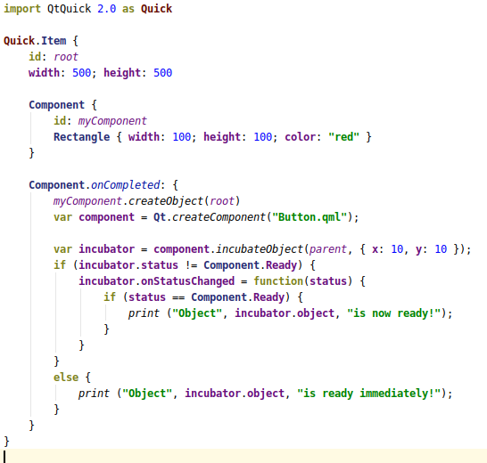
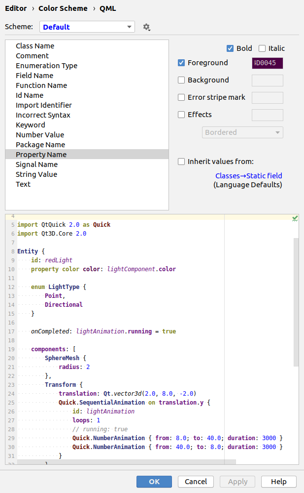
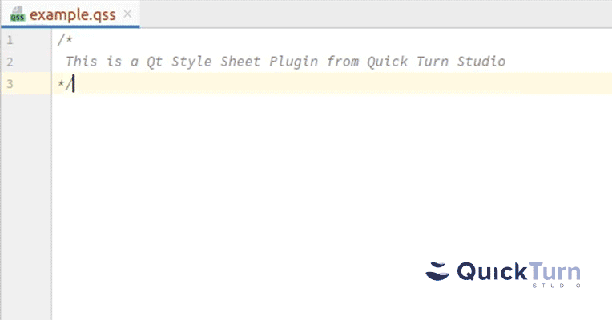

# Working with Qt in CLion project

This project is about helping Qt Community working in JetBrains Editors like CLion, PyCharm etc.

## Plugins

<h3>QML Editor</h3>
<a href="https://quickturnstudio.com">Download</a> |
<a href="https://github.com/Quick-Turn-Studio/CLionSupportForQt/issues">Request feature</a> |
<a href="https://github.com/Quick-Turn-Studio/CLionSupportForQt/issues">Report bug</a> |
<a href="https://github.com/Quick-Turn-Studio/CLionSupportForQt/issues">Vote for feature</a>  

QML Editor helps to work with QML in JetBrains Editors

 

### Features

* QML syntax highlighting.
* Incorrect syntax recognition
* Customizable Code Color Scheme
* Commenting block of codes
* More soon...

<h3>Qt Style Sheet Highlighter</h3>
<a href="https://plugins.jetbrains.com/plugin/13963-qt-style-sheet-highlighter">Download</a> |
<a href="https://github.com/Quick-Turn-Studio/CLionSupportForQt/issues">Request feature</a> |
<a href="https://github.com/Quick-Turn-Studio/CLionSupportForQt/issues">Report bug</a> |
<a href="https://github.com/Quick-Turn-Studio/CLionSupportForQt/issues">Vote for feature</a>  

Qt Style Sheet Highlighter plugin is free to use.
It improves coding [Qt Style Sheet files](https://doc.qt.io/qt-5/stylesheet.html) experience
in JetBrains Editors.

### Features

* Simple highlight of QSS file keywords and simple values.
* Incorrect syntax recognition
* Finding simple typos 
* Customizable Code Color Scheme

 

### Out of scope

This plugin does not verify logic of QWidgets and does not support code completion.   

## Other plugins
If you have any ideas or needs to boost your coding experience with Qt,
please [request a plugin or vote for existing idea](https://github.com/Quick-Turn-Studio/CLionSupportForQt/issues).

## Credits

Project is created and supported by:

Follow us on:

        
    

