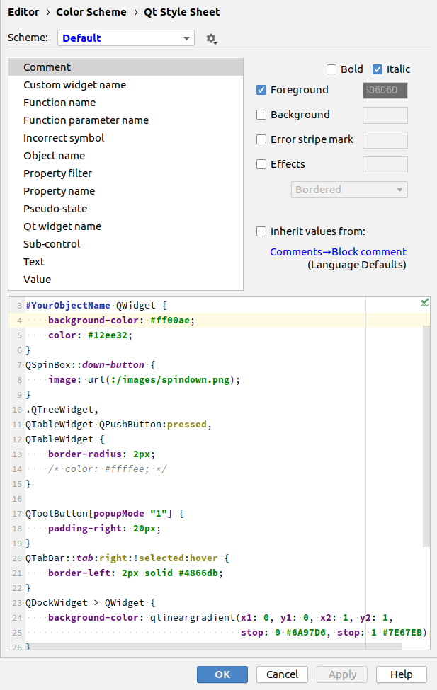

# Working with Qt in CLion project

This project is about helping Qt Community working in CLion.

## Plugins

### Qt Style Sheet Highlighter

[Download](https://www.quickturnstudio.com)
| [Request feature](https://github.com/Quick-Turn-Studio/CLionSupportForQt/issues)
| [Report bug](https://github.com/Quick-Turn-Studio/CLionSupportForQt/issues)
| [Vote for feature](https://github.com/Quick-Turn-Studio/CLionSupportForQt/issues)   

Qt Style Sheet Highlighter is free to use the plugin.
It helps working with [Qt Style Sheet files](https://doc.qt.io/qt-5/stylesheet.html).

### Features

* Simple highlighting QSS file keywords and simple values.
* Incorrect syntax recognition
* Finding simple typos 
* Customizable Code Color Scheme

 

### Out of scope

This plugin does not verify logic of QWidgets and does not support code completion.   

## Other plugins

Wanna more support for working with Qt in CLion?
[Request a plugin or vote for existing idea](https://github.com/Quick-Turn-Studio/CLionSupportForQt/issues).

## Credits

Project is supported by:

Follow us on:

    
    

